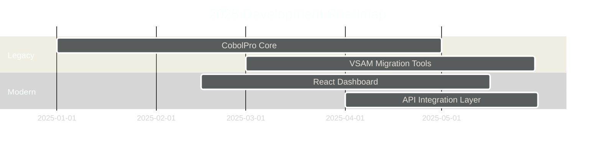

  <!-- Animated Header -->
  
  <!-- Profile Views & Social Badges -->
  

    
    
    
    
    
  

---
## 🧑‍💻 About Me
I am a **Backend Developer** specializing in **enterprise legacy systems** and **mainframe modernization**. My expertise bridges the gap between decades-old critical infrastructure and modern integration patterns.
- 🔭 **Current Project:** Building **[CobolPro](https://github.com/Juanlucasbg)** — a suite of productivity tools for COBOL developers
- 🌱 **Learning:** React, Frontend Development, and Cloud-Native Microservices
- 👯 **Collaboration:** Open-source COBOL tooling, Mainframe emulation projects, and Legacy migration frameworks
- 💬 **Expertise:** COBOL, RPG, DB2, ISPF/PDF, VSAM, CICS, JCL, z/OS utilities
- 📫 **Contact:** [juanlucasbarbier05@gmail.com](mailto:juanlucasbarbier05@gmail.com)
- ⚡ **Fun Fact:** I debug code older than I am — and make it faster.
---
## 🏆 GitHub Trophies

  

---
## 📊 GitHub Analytics
<table width="100%">
  <tr>
    <td width="50%">
      <h3 align="center">📈 Contribution Stats</h3>
      

        
      

    </td>
    <td width="50%">
      <h3 align="center">🔥 Contribution Streak</h3>
      

        
      

    </td>
  </tr>
  <tr>
    <td width="50%">
      <h3 align="center">📉 Top Languages</h3>
      

        
      

    </td>
    <td width="50%">
      <h3 align="center">📊 Contribution Graph</h3>
      

        
      

    </td>
  </tr>
</table>
---
## 💻 Tech Stack & Tools
### 🧮 Legacy & Mainframe

  
  
  
  
  
  
  
  

### 🌐 Modern & Web

  
  
  
  
  

### 🛠️ DevOps & Tooling

  
  
  
  
  

---
## 🌐 Connect With Me

  
  
  

---
## 📈 Coding Metrics
<!--START_SECTION:waka-->
<!-- If you integrate WakaTime, your coding metrics will appear here automatically -->
<!--END_SECTION:waka-->

  

---
## 🐍 Contribution Snake
<picture>
  <source media="(prefers-color-scheme: dark)" srcset="https://raw.githubusercontent.com/Juanlucasbg/Juanlucasbg/output/github-contribution-grid-snake-dark.svg" />
  <source media="(prefers-color-scheme: light)" srcset="https://raw.githubusercontent.com/Juanlucasbg/Juanlucasbg/output/github-contribution-grid-snake.svg" />
  
</picture>
---
## 🎯 Current Focus & Roadmap

> 💡 *Note: To enable the Mermaid diagram rendering, install a Mermaid renderer in your GitHub profile or use the [GitHub + Mermaid extension](https://github.com/BackMarket/github-mermaid-extension).*
---
## 📂 Featured Projects
| Project | Description | Tech Stack | Status |
|---------|-------------|------------|--------|
| **CobolPro** | Productivity toolkit for COBOL developers | COBOL, JCL, React | 🚧 In Progress |
| **LegacyBridge** | Modern API layer for mainframe systems | Node.js, DB2, CICS | 📋 Planning |
| **VSAM-Explorer** | Web-based VSAM dataset navigator | React, Node.js | 📋 Planning |
---

  

